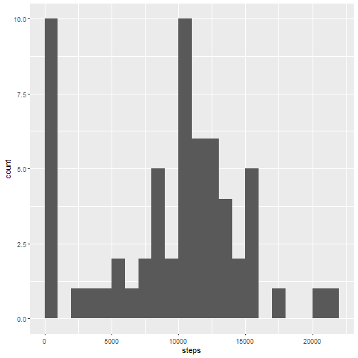
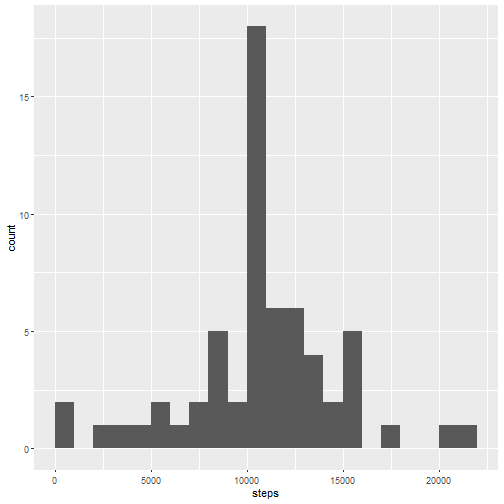
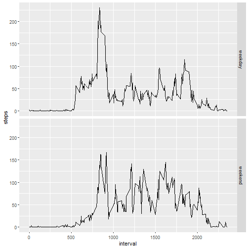

## Loading and preprocessing the data


```r
library(tidyverse)

file.name <- "activity.csv"
if(!file.exists(file.name)) {
    unzip("activity.zip")
}
steps <- read_csv(file.name, col_types = "iDi")
```

## What is mean total number of steps taken per day?


```r
steps.per.day <- steps %>%
    group_by(date) %>%
    summarise(steps = sum(steps, na.rm = TRUE))
steps.per.day %>%
    ggplot(aes(x = steps)) +
    geom_histogram(binwidth = 1000, boundary = 0)
```



```r
summary(steps.per.day$steps)
```

```
##    Min. 1st Qu.  Median    Mean 3rd Qu.    Max. 
##       0    6778   10395    9354   12811   21194
```


## What is the average daily activity pattern?


```r
steps.per.interval <- steps %>%
    group_by(interval) %>%
    summarise(steps = mean(steps, na.rm = TRUE))
steps.per.interval %>%
    ggplot(aes(x = interval, y = steps)) +
    geom_line()
```


```r
max.interval <- (steps.per.interval %>% filter(steps == max(steps)))$interval
```

The 5-minute interval 835, on average across all the days in the dataset, contains the maximum number of steps.

## Imputing missing values


```r
intervals.without.steps <- nrow(steps %>% filter(is.na(steps)))
intervals.with.steps <- nrow(steps)
```

In 2304 of 17568 intervals (13.11 %) the number of steps is missing.

We decided to substitute the missing values by the mean of the corresponding 5-minute interval:


```r
substitute.step.values <- rep(as.integer(round(steps.per.interval$steps)), 61)
steps.imputed <- steps %>%
    mutate(steps = if_else(is.na(steps), substitute.step.values, steps))
steps.per.day.imputed <- steps.imputed %>%
    group_by(date) %>%
    summarise(steps = sum(steps))
steps.per.day.imputed %>%
    ggplot(aes(x = steps)) +
    geom_histogram(binwidth = 1000, boundary = 0)
```



```r
summary(steps.per.day.imputed$steps)
```

```
##    Min. 1st Qu.  Median    Mean 3rd Qu.    Max. 
##      41    9819   10762   10766   12811   21194
```

After imputing missing data there are less days with less than 1000 steps.
We see that the mean and the median are higher than before.

## Are there differences in activity patterns between weekdays and weekends?


```r
determine.day.type <- function(date) {
    if_else(as.POSIXlt(date)$wday %in% c(0, 6), "weekend", "weekday")
}
steps.imputed <- steps.imputed %>%
    mutate(type = as.factor(determine.day.type(date)))
steps.by.interval.and.type.imputed <- steps.imputed %>%
    group_by(interval, type) %>%
    summarise(steps = mean(steps), .groups = "drop_last")
steps.by.interval.and.type.imputed %>%
    ggplot(aes(x = interval, y = steps)) +
    geom_line() +
    facet_grid(vars(type))
```



On weekdays there are more steps in the morning.
On weekends there are more steps in the afternoon.
